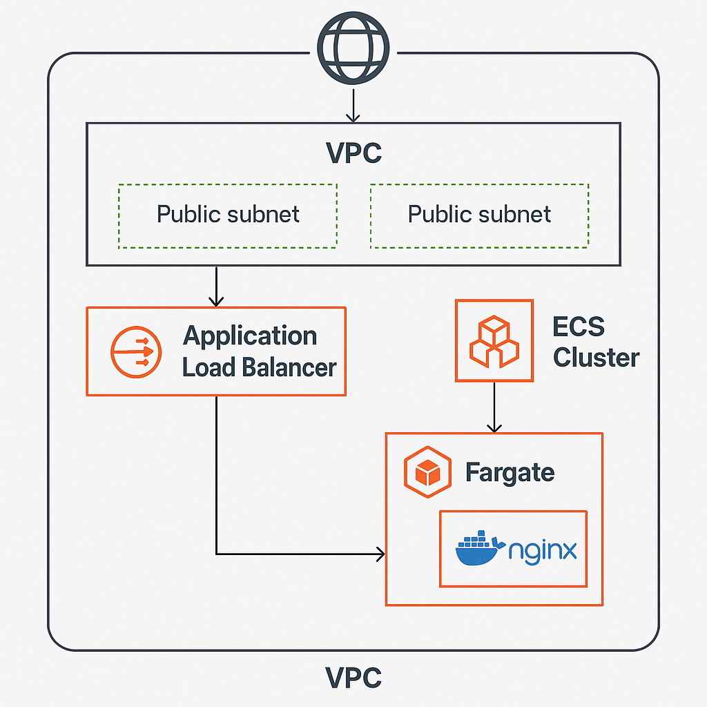

# 🚀 AWS ECS Fargate Web App (Free Tier)

This project deploys a lightweight, containerized web application using **Amazon ECS with Fargate**, fronted by an **Application Load Balancer (ALB)**. It is designed to stay within AWS Free Tier limits and is fully provisioned using Terraform.

---

## 📐 Architecture Overview



| Component              | Description                                                                 |
|------------------------|-----------------------------------------------------------------------------|
| **VPC**                | 1 VPC with 2 public subnets across different AZs                            |
| **ECS Cluster**        | Fargate-based cluster for serverless container deployment                   |
| **Fargate Task**       | Runs `nginx:latest` container with 256 CPU / 512 MiB memory                 |
| **Application Load Balancer** | Distributes HTTP traffic to ECS tasks                              |
| **Security Groups**    | ALB allows HTTP (port 80); ECS task accepts traffic only from ALB          |
| **IAM Roles**          | ECS task execution role with minimal permissions                           |
| **Route 53 (Optional)**| Public DNS for ALB (Free Tier eligible)                                     |

---

## ✅ Free Tier Alignment

| Service     | Free Tier Limit                  | Usage in Project                     |
|-------------|----------------------------------|--------------------------------------|
| ECS Fargate | 750 hours/month                  | 1 task with 0.25 vCPU / 512 MiB      |
| ALB         | 750 LCU-hours/month              | 1 ALB with minimal traffic           |
| VPC/Subnets | Always free                      | 1 VPC, 2 public subnets              |
| IAM         | Always free                      | Task execution role                  |

---

## 🧩 Terraform Module Structure
terraform/ ├── main.tf ├── variables.tf ├── outputs.tf ├── modules/ │   ├── vpc/ │   ├── ecs/ │   ├── alb/ │   └── iam/


---

## 🐳 Container Details

- **Image**: `nginx:latest` from Docker Hub
- **Port**: 80
- **CPU/Memory**: 256 CPU units / 512 MiB
- **Desired Count**: 1 task
- **Launch Type**: Fargate

---

## 🔐 Security Best Practices

- ALB Security Group: Allows inbound HTTP (port 80) from anywhere
- ECS Task Security Group: Allows inbound only from ALB
- IAM Role: ECS task execution role with least privilege

---

## 🚀 Deployment Steps

1. Clone the repo:
   ```bash
   git clone https://github.com/your-username/aws-ecs-fargate-free-tier.git
   cd aws-ecs-fargate-free-tier

2. Initialize Terraform:
terraform init

3. Review and apply the plan:
terraform plan
terraform apply

4. Access your app via the ALB DNS name output by Terraform.

📌 Optional Enhancements
- Add Route 53 DNS for friendly domain names
- Integrate with AWS CloudWatch for logging
- Use AWS Secrets Manager for secure environment variables

🧠 License & Credits
This project is open-source and designed for educational and portfolio use. Built with ❤️ using AWS and Terraform


